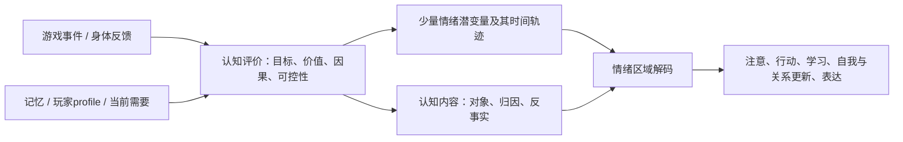

# Agent Handoff: 玩家决策、价值系统与情绪潜空间探索

- Date: 2026-07-20
- Agent/thread: Codex 主任务
- Scope: EDecision现象分类、玩家价值/需求、情绪家族、高维区域假设与最小可实现状态
- Status: complete（探索整合完成；这是研究与建模方向，不是已接入的运行时规格）

## User Intent

为西幻项目中的玩家模拟建立一套既像人、又能实际开发的内部模型。核心问题不是列出几十个情绪名，而是：

1. 玩家在什么情况下会产生有意义的决策体验；
2. 人的价值观、满足感、成就感与情绪如何互相作用；
3. 愤怒、恐惧、悲伤、骄傲等是否能由尽可能少的数值组合出来；
4. 如果真实大脑更像高维神经网络，游戏模拟应保存多少状态，怎样避免“每种情绪一个数值”的失控方案；
5. 所有结论需要受可靠研究约束，但不能把尚有争议的理论包装成已经证实的唯一答案。

## Completed

- 整理三类玩家决策体验：多方案规划、突破性洞察、自我选择。
- 将此前Insight乘法拆为五个可解释因素，并明确其适用边界。
- 把玩家价值/需求、情绪状态、认知内容和行为输出拆成不同层。
- 记录讨论中被推翻的模型：单一情绪油箱、二维情绪平面、固定基础情绪互斥表、事件名直接映射情绪值。
- 形成当前核心假设：情绪更像高维分布式状态中的区域或轨迹；少量数值是工程投影，不是大脑里带名字的六根仪表。
- 给出第一版六坐标实验模型，以及复用玩家已有认知/记忆/Agency以减少新增情绪值的方案。
- 汇总34个候选情绪家族，作为覆盖测试集，而不是34个运行时字段。
- 给出跨游戏类型的验证样例、碰撞测试、消融测试和新增维度的严格条件。

## Files Changed

- `coop_repo/reports/2026-07-20_1913_player-decision-emotion-latent-space-exploration.md`：本报告。
- `coop_repo/REPORT_INDEX.md`：登记本报告。
- `coop_repo/LATEST.md`：更新当前入口。

## Validation

- 对照上一份`EDecision、决策质量与掌控感统一设计`，保持以下边界一致：
  - EDecision只计算有效思考量；
  - QDecision评价思考是否真的推进；
  - Agency是按目标/路径保存的“看不看得到可执行路径”，不是即时情绪；
  - 情绪模型不重复结算R/A/C/EVerify已有反馈。
- 用路径规划、生存恐怖、潜行、Boss战、肉鸽/卡牌、MOBA/RTS和模拟经营检查三类决策是否都有落点。
- 用愤怒/恐惧、悲伤/沮丧、骄傲/开心、后悔/内疚/羞耻检查六坐标模型；确认仅靠六个数值仍会碰撞，必须读取认知内容和目标对象。
- 研究依据优先采用元分析、大样本跨文化研究、综述与同行评议实验。它们支持“效价和激活度不够”“情绪具有高维结构”“认知评价与情绪系统相关”“神经群体可形成低维吸引子”等约束，但没有任何一项研究证明本报告的六坐标正是人脑的真实实现。
- 本轮未修改运行时代码，因此没有代码回归。

## Current State

### 1. 三种需要分别建模的决策体验

#### 1.1 多方案规划：在可能空间里有效搜索

玩家暂时没有唯一答案，会试探、比较和修改方案。典型例子是路径规划中斜走次数、大跳次数有限；潜行中比较路线、巡逻间隙与消耗品；卡牌中寻找出牌顺序。

这里的体验来自“我正在展开可能性”。普通有效思考应该产生少量正反馈，但反馈上限必须受玩家profile中的常态思考量和复杂度偏好限制，否则Agent会因为无限枚举而无限开心。

#### 1.2 突破性洞察：一次主观选项压缩

洞察不是“算得多”，而是某条信息突然重构问题，使大量候选方案失去必要性，类似数独找到突破口、发现Boss弱电、意识到守卫路线存在共同盲区。

当前保留的概念式为：

```text
Insight =
  novelty
  × comprehension
  × discrimination
  × subjectiveOptionCompression
  × subjectiveConfidenceGain
```

各项含义：

- `novelty`：这次理解对玩家是不是新信息。重复看攻略中已经知道的Boss弱点，接近0。
- `comprehension`：玩家是否真的理解信息怎样改变问题。只看到“Boss冒蓝光”但不知道含义，较低。
- `discrimination`：信息能否区分互相竞争的解释。发现只有蓄力攻击会被电打断，比“电似乎有效”区分度更高。
- `subjectiveOptionCompression`：在玩家自己的认知里，候选方案从多少压到多少。十条路线压成一条，远高于十条压成九条。
- `subjectiveConfidenceGain`：压缩后玩家对剩余方案的把握提高了多少。排除了很多路线但剩下两条仍完全看不懂，不能得到完整洞察反馈。

乘法的意义是任一关键环节缺失都不应产生完整“破局感”，不是宣称人脑真的执行这条乘法。正式接线时还要避免与EVerify的验证/确认反馈重复结算。

#### 1.3 自我选择：未来不可算尽时表达“我想成为谁”

背包有限时带药还是武器、开放区域先探索哪里、肉鸽选稳健强牌还是偏爱的流派、模拟经营优先效率还是美观，都可能没有可证明的最优答案。人通常不会只算胜率，还会选择符合偏好、身份和当下欲望的玩法。

自我选择的体验不是低质量EDecision。它主要来自：

- 选项确实有差异；
- 玩家理解自己放弃了什么；
- 结果归因于自己的偏好，而不是系统强迫；
- 选择能表达能力、风格、关系、道德或独特性。

“变强”和“变得特别”可被视为不同的意义通道，但不能直接断言所有人本质上只追求一种抽象意义。工程上应把它们保存为玩家价值/profile中的不同权重：功利效率、独特性、自我一致、关系承诺、社会认可等。

### 2. 跨类型游戏检查

| 游戏类型 | 多方案规划 | 洞察压缩 | 自我选择 |
| --- | --- | --- | --- |
| 路径/解谜 | 核心：枚举路线与资源次数 | 核心：发现约束突破口 | 较少，除非多解有风格差异 |
| 生存恐怖/《生化危机》式 | 背包、战斗和绕行规划 | 敌人弱点、地图捷径 | 药/弹药/武器、探索顺序 |
| 叙事潜行/《美末》式 | 路线、诱敌、资源组合 | 巡逻盲点和环境机制 | 杀/绕、资源使用、探索 |
| Boss战 | 试探招式和环境组合 | 识别阶段、弱点、反制窗口 | 风险打法、build与消耗品 |
| 肉鸽/卡牌 | 出牌序列与未来构筑 | combo、敌人意图、牌池规律 | 构筑身份和风险偏好很强 |
| MOBA/RTS | 局部路线、技能/兵种次序仍有 | 宏观窗口、资源拐点很强 | 阵容、战略风格和风险承担 |
| 模拟经营 | 资源调度与长期规划很强 | 发现瓶颈和正反馈回路 | 美学、效率、叙事目标都很强 |

因此“MOBA/RTS没什么第一类”“肉鸽基本全是第三类”都过于绝对。不同类型只是三类体验的权重和时间尺度不同。

### 3. 价值、需求、满足感与成就感

当前最有用的玩家侧假设是：Agent存在一个学习得到的价值模型。身体反馈、家庭环境、成长经历、社会反馈与长期选择共同塑造“什么值得接近、维持、修复或避免”。饥饿不是抽象知识，而是身体反复提供的高优先级负反馈；玩法偏好则更多由历史强化、自我叙事和社会关系形成。

用户提出的易理解需求序列可暂作玩家profile的组织方式：

```text
安全
→ 掌控 / Agency
→ 浪漫 / 连接
→ 他人认可
→ 自我认可
```

它不是已获公认的普适人类需求金字塔，也不应强制单向解锁。人在不安全时仍会追求连接、尊严或自我实现。更稳妥的实现是多个需要同时存在，匮乏度、当前可达性和个人权重共同决定注意力。

“满足感—成就感循环”则适合作为调节机制：

- 低资源、低情绪容量或连续失败时，更偏好低难度、确定性恢复活动；
- 恢复后，更愿意追求有难度、能证明能力或推进身份目标的活动；
- 挑战失败会降低控制感和可用资源，使玩家重新寻求恢复；
- 不同profile的恢复阈值、挑战欲、失败耐受和意义来源不同。

它能解释玩家节奏，但不是完整情绪本体。一个悲伤的人可能仍然高激活，一个“心如死灰”的人仍可能出现急性恐惧；因此不能把所有情绪压成“油量充足/不足”。

### 4. 讨论中被推翻或降级的模型

#### 4.1 单一油箱

效价或“情绪充足度”能描述总体好坏，却不能区分同为负向、高激活的愤怒和恐惧，也不能解释悲伤、羞耻、后悔和厌恶的不同后果。它可作为全局状态，不能独立决定情绪家族。

#### 4.2 开心—悲伤、愤怒—恐惧二维平面

愤怒与恐惧并不是一条轴的两个端点。它们可能竞争主导行为，但同一人可以同时存在攻击冲动和逃离冲动；冻结、犹豫和“又怕又气”正是冲突结果。开心和悲伤也存在可测量的混合体验，不能因为最终表现只有一个就假设内部只允许一个状态。

#### 4.3 “基础情绪互斥，某一刻只能有一个”

行为输出常需要单一选择，不等于内部只有一个情绪区域被激活。更合理的是多个状态共同存在，通过注意、控制、习惯和情境竞争出当前主导表达。

#### 4.4 事件流就是情绪定义

“谁对我做了什么”不是愤怒本身，但完全删除事件解释也会使后悔、内疚、羞耻、感激与骄傲发生碰撞。当前折中是：情绪状态只保存少量投影；事件对象、因果归属、反事实和价值领域留在认知/记忆层，由解码器读取。

#### 4.5 用尖叫反推恐惧本体

尖叫可发生在突发威胁、疼痛、惊喜、社交感染等不同情境，不能用单一“防御激活”定义恐惧。用户强调的“一瞬间压力爆炸”应保留为时序和激活度问题：急剧变化可能触发声带、动作和自主反应，但表达通道不是情绪家族本身。

### 5. 当前核心：高维区域，而不是带名字的仪表

更接近当前理解的说法是：

- 人脑不是先把事件翻译成`anger = 0.83`，再调用攻击函数；
- 感官、身体、记忆、价值、当前目标与关系模型共同形成高维神经群体状态；
- 长期进化与个体学习使某些状态区域或轨迹稳定地偏向某些注意、预测、动作和学习结果；
- 人把其中一部分相似经验命名为愤怒、恐惧、悲伤、骄傲；
- “对抗”“逃离”“掌控”等是人类可解释的投影，不必假定它们各自对应一颗专用神经元。

但“高维空间里有很多区域”不等于运行时要有很多数值。一个低维空间可以包含很多区域；同一区域也能根据认知内容连接不同输出。



这也解释了为什么骄傲不一定产生像愤怒一样的即时动作。不同情绪区域可以写向不同“输出端口”：

```text
EmotionRegion -> {
  immediateActionBias,
  attentionBias,
  goalUpdate,
  learningUpdate,
  selfModelUpdate,
  relationshipUpdate,
  expressionBias
}
```

愤怒通常强烈影响即时行动和注意；骄傲更多提高自我效能、策略保留、未来风险容忍和地位表达；悲伤可能改变目标维持与社会支持寻求。没有立刻行动，不等于不是情绪。

### 6. 第一版最小工程投影

第一轮隔离实验可使用六个连续量：

```text
全局状态：
  valence             整体趋好 / 趋坏
  arousal             系统动员和激活水平

情绪家族坐标：
  interventionDrive   主动改变、阻止、修复或压倒当前状态
  withdrawalDrive     远离、隐藏、切断接触或降低暴露
  control             主观可控性 / 有无可执行路径
  lossGap             曾拥有、期待或应当存在之物与当前现实的落差
```

重要边界：

- `interventionDrive`比“对抗”更宽，既能表达攻击，也能表达补救、追回和强行改变。
- `interventionDrive`与`withdrawalDrive`先按两个独立量处理；两者同时高可以产生冲突、冻结或摇摆，不能预先强制为一条数轴。
- `control`与现有Agency语义接近。首轮为了可观察性保留为第六个量；如果影子实验表明它总能由`Agency(goal,path)`与当前信念推出，应删除重复存量。
- `lossGap`不是单纯“负效价”，它专门保留失去、落空、不可逆和反事实差异。
- 六个量是工程特征，不是“科学已发现人脑只有六个情绪参数”。

情绪标签必须联合解码：

```text
emotionRegion = Decode(
  valence,
  arousal,
  interventionDrive,
  withdrawalDrive,
  control,
  lossGap,
  activeNeed,
  attentionTarget,
  beliefState,
  recentMemory,
  trajectory
)
```

典型区域不是硬阈值，而是原型：

| 情绪原型 | 六坐标倾向 | 必须读取的内容 |
| --- | --- | --- |
| 愤怒 | 负效价、高激活、高干预、较高控制 | 当前阻碍/侵犯对象，规则或目标受阻 |
| 恐惧 | 负效价、高激活、高撤离、低控制 | 威胁对象与预计伤害 |
| 悲伤 | 负效价、高落差、低控制、低即时干预 | 有价值对象的失去与恢复可能性 |
| 挫败 | 负效价、高干预、中低控制、落差上升 | 目标仍有效但连续受阻 |
| 骄傲 | 正效价、较高控制；动作倾向不固定 | 自我归因、标准达成、身份/地位更新 |
| 后悔 | 负效价、高落差、当前控制低 | “我本可以选另一条”的反事实记忆 |
| 内疚 | 可与后悔共用大量坐标 | 自己伤害他人、责任与修复可能 |
| 羞耻 | 负效价、低控制、高撤离 | 对整体自我价值的负面评价和社会目光 |
| 厌恶 | 负效价、撤离较高 | 污染/排斥对象，而非预计攻击威胁 |
| 宽慰 | 效价快速上升、激活回落 | 先前威胁预期被解除的轨迹 |

这张表直接说明：六坐标不能单独命名所有情绪。后悔和内疚的差别主要存在于反事实、责任对象和修复目标中；骄傲与普通开心的差别主要存在于自我归因。若这些信息在Agent认知层已经存在，就没有理由为每种差别再添加一个情绪数值。

### 7. 候选情绪家族覆盖表

下列34项是从体验、表达、社会情绪和决策影响角度整理的候选覆盖集：

1. 兴趣/好奇
2. 欲望/渴求
3. 快乐/愉悦
4. 玩乐/逗趣
5. 满足/安宁
6. 宽慰
7. 希望
8. 爱/依恋
9. 性欲
10. 关怀/同情
11. 感激
12. 敬佩
13. 骄傲
14. 敬畏
15. 审美沉浸
16. 愤怒
17. 恐惧
18. 焦虑
19. 悲伤/哀伤
20. 分离痛苦/孤独
21. 厌恶
22. 蔑视
23. 挫败
24. 失望
25. 后悔
26. 内疚
27. 羞耻
28. 尴尬
29. 羡慕
30. 嫉妒
31. 惊讶
32. 困惑
33. 无聊
34. 怀旧

这不是“人类恰好有34种生物学基础情绪”。其中有些可能是高阶组合、社会评价、认知状态或跨时间混合体验。它们的用途是做覆盖和碰撞测试：如果模型能在不同情境中产生合理的注意、选择、学习和表达差异，就不需要先决定它们在哲学上是不是同一种东西。

### 8. 研究依据与能够支持的结论

#### 8.1 可以较有把握采用的约束

- 效价和激活度不能充分表达所有情绪差异。Cowen与Keltner的大样本视频研究得到27个由连续梯度连接的自我报告类别；自然面部/身体表达研究得到至少28个可区分类别，并发现类别判断比效价、激活度等通用量包含更多信息。
- 这些类别不是边界绝对清楚的盒子。研究同时强调类别之间存在连续梯度，这与“区域/流形”比“互斥枚举”更一致。
- 情绪具有跨文化共享结构，但表达强度和具体呈现受文化影响。2024年跨北美、欧洲、日本的45,231段反应研究得到21个跨语言保存的体验维度，同时发现文化特定的表达强度。
- 认知评价与情绪之间存在稳定统计关系。2024年元分析覆盖309项研究、2,634个效应量、47类评价与63种情绪；多数既有假设关系显著，但研究也明确指出各理论对评价维度列表和术语仍不一致。
- 愤怒不能只看负效价。经典研究将愤怒与趋近动机联系起来；恐惧与愤怒在控制感、确定性、风险估计和选择上可产生相反结果。
- 正负情绪可以共同出现。混合情绪元分析纳入63项独立研究、7,157名参与者，支持混合体验是可测量现象。
- 神经系统确实可以用群体活动和低维吸引子维持、整合状态；2024年小鼠研究还对观察攻击时的持续内部状态提供了线吸引子的因果证据。但这不能外推为“所有人类情绪都是同一种吸引子”，本报告仍将其作为受证据启发的工程类比。
- 骄傲属于需要自我评价的自我意识情绪，且会通过成就、自信、声望/支配等路线影响社会行为；这支持“情绪可主要更新自我与社会模型，而非必须立即攻击或逃跑”。

#### 8.2 不能冒充权威结论的部分

- 学界没有公认的唯一情绪数量；
- 27、28、21等数字依赖刺激、测量方式、文化和统计标准，不能直接变成运行时字段数量；
- “高维区域”是比离散按钮更合适的工作假设，但当前报告没有证明真实情绪恰好形成某种固定几何体；
- 六坐标、`lossGap`和输出端口是项目设计假设，需要仿真验证；
- 用户提出的五层需求序列和满足—成就循环是可操作的玩家模型，不是普适心理定律。

#### 8.3 主要来源

- [Cowen & Keltner, 2017：27种由连续梯度连接的情绪类别](https://pubmed.ncbi.nlm.nih.gov/28874542/)
- [Cowen & Keltner, 2020：自然面部/身体表达中的28类情绪](https://pubmed.ncbi.nlm.nih.gov/31204816/)
- [Cowen et al., 2024：跨文化45,231段反应与21个体验维度](https://pubmed.ncbi.nlm.nih.gov/38966733/)
- [Yeo & Ong, 2024：认知评价—情绪关系元分析](https://pubmed.ncbi.nlm.nih.gov/39404856/)
- [Lerner & Keltner, 2001：恐惧、愤怒、控制感与风险](https://doi.org/10.1037/0022-3514.81.1.146)
- [Harmon-Jones & Allen, 1998：愤怒与趋近动机](https://doi.org/10.1037/0022-3514.74.5.1310)
- [Berrios et al., 2015：混合情绪元分析](https://pmc.ncbi.nlm.nih.gov/articles/PMC4397957/)
- [Nummenmaa et al., 2018：多类情绪的分布式脑活动模式](https://pubmed.ncbi.nlm.nih.gov/29618125/)
- [Khona & Fiete, 2022：大脑吸引子与积分网络综述](https://www.nature.com/articles/s41583-022-00642-0)
- [Vinograd et al., 2024：小鼠攻击相关内部状态的线吸引子因果证据](https://www.nature.com/articles/s41586-024-07915-x)
- [Tracy et al., 2023：骄傲、自我评价与社会地位综述](https://www.annualreviews.org/content/journals/10.1146/annurev-psych-032720-040321)
- [Freed & Mann, 2007：悲伤与永久丧失的神经—生物—心理—社会模型](https://psychiatryonline.org/doi/abs/10.1176/ajp.2007.164.1.28)

### 9. 与正式玩家模拟的边界

建议维持四层，不互相重复：

```text
玩家价值/profile
  决定什么重要、喜欢何种复杂度和意义路径

认知/记忆/Agency
  保存对象、因果、预期、反事实、目标路径与主观可控性

情绪潜状态
  保存全局效价/激活与少量行动方向、落差

EDecision/QDecision
  评价本次思考过程的有效量与推进质量
```

具体规则：

- 自我选择可以很有价值，但不因“符合我的风格”自动获得高QDecision；
- 洞察可同时影响Decision反馈、Confidence与Agency，但每种反馈必须从不同语义结算，不能重复加分；
- Agency是分目标持续状态，情绪`control`若保留只能代表当前显著情境的即时投影；
- 玩家profile调节情绪生成和衰减，不应被某次情绪反向永久改写；
- 愤怒/恐惧等标签主要用于解释、表达和策略偏置，不应先成为程序硬编码行为树的唯一开关。

## Unresolved

- 六坐标是否足够尚未验证，尤其是厌恶/恐惧、悲伤/失望、羞耻/内疚的碰撞率。
- `lossGap`是否能由效价轨迹、预期差和记忆直接推导，还是必须保存独立状态。
- `interventionDrive`与`withdrawalDrive`应独立共存，还是可在部分情况下压成一条趋近—回避轴。
- `control`是否与正式Agency重复；需要同一批案例的相关性和行为消融结果。
- 快乐是否可为项目压成一个正向前景状态，还是需要至少区分满足、逗趣、兴趣、希望、敬畏、骄傲。研究支持正向体验并非完全同质，但工程上是否需要区分取决于决策输出。
- 情绪区域解码应采用规则、LLM解释、学习出的probe，还是“连续量更新规则 + 认知上下文 + LLM语义解码”的混合方案。
- 情绪共存、主导权切换和持续时间尚无明确动力学；只看单帧会丢失惊讶、宽慰、怨恨、哀伤等轨迹。
- 当前34家族仍可能漏掉游戏中特别重要的体验，也可能把认知状态误列为情绪，需要通过案例而不是继续凭词表争论。

## Recommended Next Step

先不要接正式情绪运行时。实现一个隔离的`player-emotion-latent`计算器和30至50个确定性案例：

1. 每个案例记录事件、玩家profile、活动需要、信念/记忆、六坐标变化、预期情绪标签和七类输出端口；
2. 优先覆盖生存恐怖、潜行、Boss、肉鸽/卡牌、MOBA/RTS、模拟经营，以及骄傲、后悔、内疚、羞耻等无直接动作情绪；
3. 做碰撞测试：若六坐标相同但上下文不同，先确认现有认知层能否解码；只有“六坐标、相关认知、轨迹都相同而决策仍系统性不同”时才允许增加第七个情绪值；
4. 做消融测试：逐个移除`control`、`lossGap`、干预或撤离，观察哪些案例不可区分；
5. 与V27只做旁路影子记录，不改变Agent选择和正式反馈；
6. 完成案例校准后，再决定哪些量需要持久化、哪些应从Agency/记忆即时推导。

这一步的目标不是证明人脑只有六个数值，而是找到“对玩家行为足够、与现有认知不重复”的最小工程表示。
