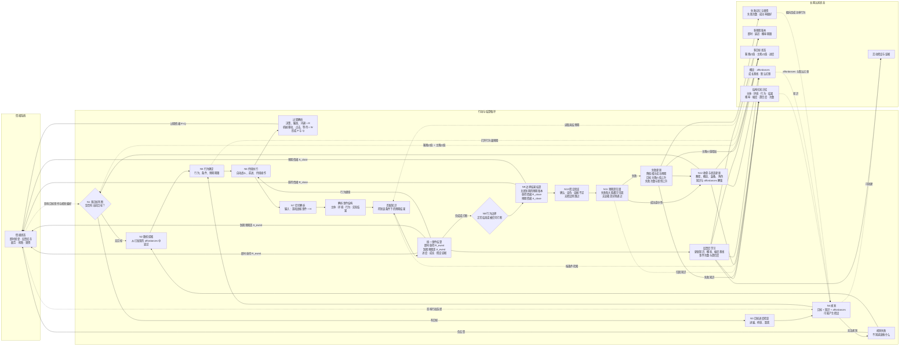

# 玩家认知模型基础讲解

## 一句话版本

玩家不是直接从游戏规则跳到情绪。完整链路是：

```text
游戏发出信号
→ 玩家感知并识别概念
→ 调用或更新知识
→ 发现当前可行动机会（affordances）
→ 形成假设
→ 选择并执行行为
→ 观察结果并验证假设
→ 更新知识、预期和情绪
→ 决定下一步
```

任何分析都必须沿这条链传递信息。不能直接填写“玩家理解度=1”或“进度反馈=2”，再用这些输入证明模型有效。

## V1认知行动循环

这张图把情绪、行动循环和长期认知状态拆成三个区域。节点是离散的认知或结算时刻；“持续执行”是一段已经确定大致行为、期间只进行必要反应的过程。



### H输入

N7只在图中显示一个输入 `H`，内部仍保持四个分量：

```text
H = 显著性 × 感知清晰度 × 因果清晰度 × 当前目标相关性
```

H决定事件有多少内容能成为玩家证据。AI可以读取完整战报作为游戏真相，但模拟玩家只能使用经过H筛选、能够感知和归因的部分。

### E、W、P、Q

E不只来自正式规划。当前分为：

- `E_decision`：N4中比较知识、目标和行为并做出决定；
- `E_reactive`：执行过程中需要注意和调整的本能反应，例如瞄准、闪避、临时选目标；
- `E_verify`：N10中主动比较假设和证据。

单纯移动、机械点击、自动攻击和不需要判断的等待属于W。E与W的数量和分布形成P与Q，过程情绪在执行期间持续进入情绪系统。

### 统一事件结算与预期账本

大事和小事使用同一套结算逻辑。伤害、击杀、掉落、通关和角色奖励的区别只来自事件内容及预期期限，不来自不同公式。

每条可感知信号被解析为：

```text
主体 subject
+ 环境 environment
+ 行为 behavior
+ 实际结果 result
```

例如：

```text
法师 + 魔法塔 + 攻击 + 造成高额法术伤害
玩家小队 + 第三关 + 击杀普通怪 + 掉落一件装备
```

解析器用前三类条件匹配知识库中的结果分布，得到预期，再与实际结果比较。知识可以保存确定值、幅度范围、成功概率、次数与置信度。

事件级A和边界级A不是两套机制：

- 立即结果在当前信号结算；
- 延迟结果留在预期账本；
- 概率结果在成功、期限到达、干旱异常或行为结束时结算；
- N9只负责关闭此时已经到期但尚未结算的账本。

固定更新顺序为：

```text
读取旧知识与旧预期
→ 解析当前信号
→ 比较预期和实际
→ 产生获得情绪与预期情绪
→ 更新目标进度和假设证据
→ 最后更新知识、概率、次数与成长基线
```

因此“习惯了”主要表现为知识中的预期逐渐逼近实际，而不是先随意扣除一个新鲜度参数。事件曝光仍可影响注意，但不能替代认知更新。

### 多目标与失败

每个目标至少保存：

- 客观价值：游戏结果本身的重要性；
- 主观价值：玩家对“我必须完成它”的认可程度；
- 当前进度与可见差距。

失败首先在N9产生负面结果和预期差，随后经过验证与归因。状态更新时：

1. 降低相同条件下的成功预期；
2. 提高该目标的主观价值；
3. 记录失败次数并增加对应畏惧；
4. 让后续规划更偏向玩家认为成功率高的行为。

目标增值和畏惧需要上限及衰减规则，但这些数值留到后续节点细化，不在基础循环中提前决定。

## 1. 信号与感知

**信号**是游戏实际提供给玩家的内容，例如：

- 敌人血条减少；
- 出现伤害数字；
- 装备掉落并发光；
- 按钮变为可点击；
- 任务进度从 `1/10` 变为 `2/10`；
- 角色释放技能并产生明确特效。

**感知**是玩家实际接收到多少信号。信号存在，不代表玩家一定看到。大小、颜色、运动、遮挡、同时出现的竞争信号和玩家当前目标都会影响接收结果。

感知层只能读取游戏真实发出的信号，不能读取设计者意图或隐藏规则。

## 2. 概念

概念是玩家给感知结果贴上的认知标签，例如：

- “这是一次暴击”；
- “这个敌人很硬”；
- “紫色装备比较稀有”；
- “监狱是可选关卡”；
- “我的前排扛不住”。

概念不必正确。玩家可能把中毒伤害误认为敌人普攻，也可能暂时不知道某个现象叫什么。

概念解决的是“玩家认为自己看到了什么”。

## 3. 知识

知识是玩家目前相信的关系和规则，并带有来源、置信度与适用范围，例如：

```text
换武器 → 伤害提高，置信度 0.8
游侠 → 擅长持续输出，置信度 0.6
前排死亡 → 可能因为护甲不足，置信度 0.4
```

知识来源包括：

- 明确教学；
- 首次经历；
- 多次统计；
- 假设验证；
- 玩家错误归因。

知识解决的是“玩家现在相信什么”。不要把正式游戏规则直接复制成玩家知识。

## 4. Affordance：可行动机会

`affordance` 指玩家此刻认为自己可以采取的行动，不等于界面里客观存在的功能。

例如：

- 换装备；
- 换角色；
- 调整站位；
- 重试关卡；
- 去低级区域刷装备；
- 暂时跳过支线。

一个按钮存在，但玩家没看到、没理解或认为成本太高，就不构成有效 affordance。

每个 affordance 至少包含：

- 是否被玩家发现；
- 它可能解决什么问题；
- 玩家相信它有多大成功概率；
- 预期改善；
- 时间、资源和情绪成本。

Affordance 解决的是“玩家认为自己现在能做什么”。

## 5. 假设

假设连接问题、原因、行为和预期结果：

```text
问题：打不过守关敌人
原因：我认为前排生存不足
行为：给前排换上护甲装备
假设：换装后前排存活时间会明显增加
```

最小有效决策链是：

```text
problem → cause → behavior → hypothesis
```

只有玩家已感知到问题、拥有相关知识并发现可执行行为时，假设才能成立。不能通过直接声明数组来假装玩家已经完成推理。

## 6. 行为

行为是玩家最终选择并实际执行的 affordance。

选择取决于玩家当前知识，而不是设计者知道的最佳答案。一个简化选择逻辑可以比较：

```text
行为吸引力 ≈ 归因匹配度 × 预期改善 × 因果置信度 ÷ 尝试成本
```

情绪和反馈库存可以影响玩家愿不愿意继续尝试，但不能替代对具体行为的选择。

行为解决的是“玩家实际做了什么”。

## 7. 验证

行为完成后，玩家需要把结果与假设中的目标进行比较：

- 确认：前排确实多活了 5 秒；
- 推翻：换装后仍然立刻死亡；
- 不确定：战斗太混乱，看不出是否改善。

验证结果更新知识置信度、行为偏好和未来预期。没有比较，就只有结果，不算完成验证。

验证解决的是“这次尝试是否证明了玩家的想法”。

## 8. 情绪

情绪不是独立于认知链的最终分数。它来自玩家对过程、结果和预期差的解释：

```text
过程反馈 = P × Q
结果反馈 = R
预期差反馈 = A(R - kP)
```

- `P`：玩家主观经历了多少过程；
- `Q`：过程本身舒服、清晰、有意义，还是重复、混乱、痛苦；
- `R`：玩家理解并重视的实际结果；
- `k`：玩家根据历史学到的单位过程预期回报；
- `A`：结果高于或低于预期时的惊喜或失望。

情绪会影响后续尝试意愿、注意分配和放弃风险，但不能凭空创造知识或行为。

## 各部分的区别

| 部分 | 回答的问题 | 例子 |
|---|---|---|
| 信号 | 游戏发出了什么？ | 装备发光、血条下降 |
| 感知 | 玩家实际注意到了什么？ | 看见紫光，但没看见小字 |
| 概念 | 玩家把它理解成什么？ | “这是稀有装备” |
| 知识 | 玩家相信什么规律？ | “紫装通常更强” |
| Affordance | 玩家认为现在能做什么？ | 捡起、装备、分解 |
| 假设 | 玩家预测某个行为会怎样？ | “换上后能过关” |
| 行为 | 玩家实际做了什么？ | 给前排装备紫甲 |
| 验证 | 结果是否支持假设？ | 存活时间增加，假设确认 |
| 情绪 | 玩家如何评价整个过程和结果？ | 成长感、满足、失望 |

## 正确的模拟边界

玩家模拟的输入应来自游戏事件和玩家可见状态：

```text
游戏规则/界面变化
→ 可见事件日志
→ 信号接收与概念识别
→ 知识、affordance、假设和行为
→ P/Q/R/A 与情绪
```

测试可以直接修改游戏规则、敌人、掉落、UI信号和可选行为；不能直接修改中间心理参数来宣称玩法有效。直接修改心理参数只能用于公式单元测试。

## 当前项目的实现状态

当前项目已经拥有较丰富的 P/Q/R/A 评分与部分知识、假设结构，但完整认知循环尚未全部接通：

- H 的显著性和目标相关性仍未稳定门控证据接收；
- EDecision 仍可能由声明数据直接产生，而不是从证据链推导；
- Agency 数值尚未真正控制 affordance 排序和下一步行为；
- 验证结果尚未完整更新长期知识和预期；
- 情绪模型目前更接近单局评分器，而不是完整的学习型玩家。

因此，使用此 skill 时必须区分：

1. **概念模型已经定义了什么；**
2. **当前代码真正实现了什么；**
3. **某个测试是在验证玩法，还是只在验证公式接线。**
